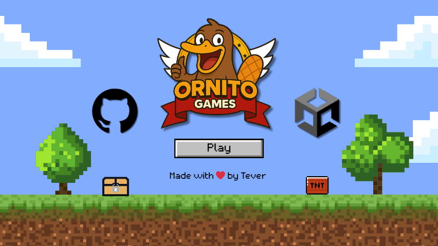

# 🎮 OrnitoGames — Crea videojuegos desde cero

  

**OrnitoGames** es un proyecto de innovación educativa y desarrollo de videojuegos. Unimos la pasión por jugar con el aprendizaje práctico para crear experiencias interactivas, accesibles y divertidas, pensadas tanto para la comunidad educativa como para quienes aman los videojuegos.

---

## 🚀 Objetivos

- 🎮 Desarrollar videojuegos educativos y de entretenimiento.  
- 📖 Documentar el proceso como material de aprendizaje.  
- 🤝 Fomentar la colaboración entre profesorado, alumnado y creadoras/es.  
- 🌍 Compartir recursos, tutoriales y código abierto.  

---

## 🦦 Filosofía

Creemos que **aprender debe sentirse como una aventura**.  
Con videojuegos, misiones y experimentación buscamos:  

- 💡 Innovar dentro y fuera del aula.  
- 📚 Generar materiales abiertos y colaborativos.  
- 🕹️ Usar el juego como motor del aprendizaje.  

---

## 🛠️ Tecnologías

Actualmente trabajamos con:

- [Unity](https://unity.com/)  
- [Node.js](https://nodejs.org/)  

*(La lista crecerá conforme avancemos en el canal)*

---

## 🛴 Minitutoriales

Es importante desarrollar diferentes ejemplos de juegos y para ello tenemos los siguientes minitutoriales:

- [Instalación Unity en 2025](https://www.youtube.com/watch?v=7yNGMrUsARs) => Instalación de Unity en 2025 con UnityHub
- [Entorno de Desarrollo de Unity](https://github.com/devTever/entorno-desarrollo-unity) => Conoce el entorno de desarrollo de Unity

*(La lista crecerá conforme avancemos en el canal)*

---

## 🎨 Juegos Cortos

Juegos cortos donde aprender diferentes tipos de mecánicas y tipos de juegos:

- [Pong](https://github.com/devTever/pong-unity) => Desarrollo del videojuego clásico
- [Crimen en Palacio](https://github.com/devTever/CrimenEnPalacio) => Aventura conversacional

*(La lista crecerá conforme avancemos en el canal)*

---

## 🚀 ​Proyectos Anuales

Los proyectos más completos se van a desarrollar a lo largo de un curso académico completo. Estos son los que estamos desarrollando:

- Curso 25-26 => [Platys vs Penguins](https://github.com/devTever/platys-vs-penguins) => Juego con estilo similar a Angry Birds pero con personalidad propia.

*(La lista crecerá conforme avancemos en el canal)*

---

## 💻​ Especificaciones Equipo para Desarrollo

Si quieres realizar los proyectos que estamos desarrollando en Ornitogames necesitarás un equipo informático que permita hacer funcionar Unity.

Las *especificaciones mínimas* para ese equipo son:
- **CPU:** Intel i5 (8ª gen o más) / AMD Ryzen 5 (serie 3000 o más).
- **RAM:** 8 GB (pero irás muy justo).
- **GPU:** Gráfica integrada moderna (Intel Iris Xe o AMD Vega integrada) o dedicada básica (GTX 1050).
- **Disco:** 256 GB SSD (mejor NVMe).
- **SO:** Windows 10/11 64-bit, macOS Big Sur o Ubuntu 22.04.

Si quieres Unity vaya más fluido y para proyectos 3D las *especificaciones recomendadas* son:
- **CPU:** Intel i7 (11ª gen o más) / AMD Ryzen 7 (serie 5000 o más).
- **RAM:** 16 GB.
- **GPU:** Dedicada GTX 1660 / RTX 2060 o superior (también vale Radeon RX 6600).
- **Disco:** 512 GB – 1 TB SSD NVMe.
- **Pantalla:** Full HD (1920x1080), mejor con dos monitores.

---

## 📜 Licencia

Los proyectos se publican bajo la licencia **Creative Commons BY-NC-SA 4.0**.  
Puedes usar, modificar y compartir el contenido **con atribución, sin fines comerciales y manteniendo la misma licencia**.  

---

> 🦦 **OrnitoGames: donde aprender y jugar se encuentran.**

---

